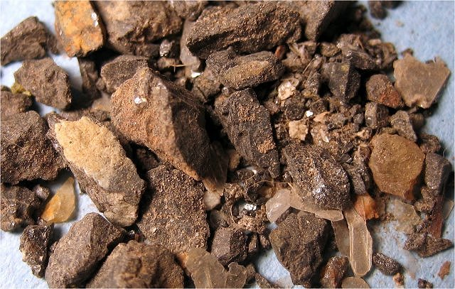
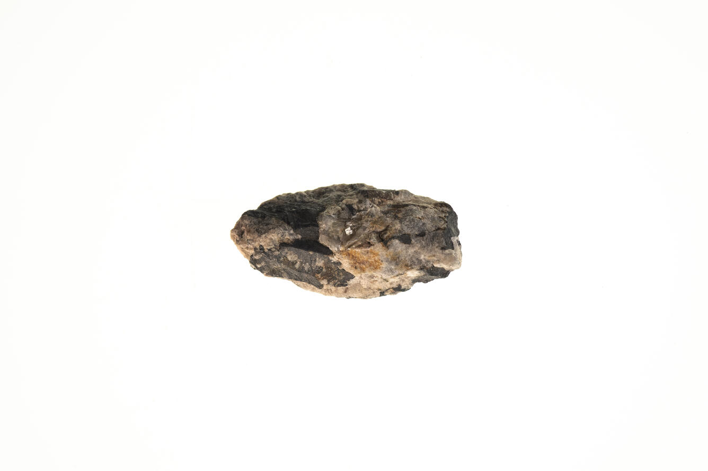
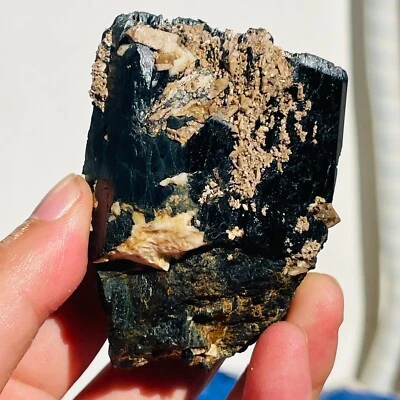
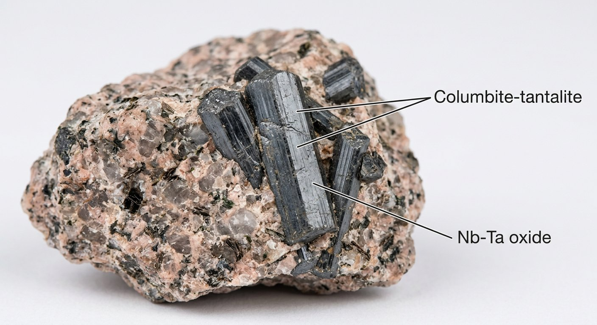
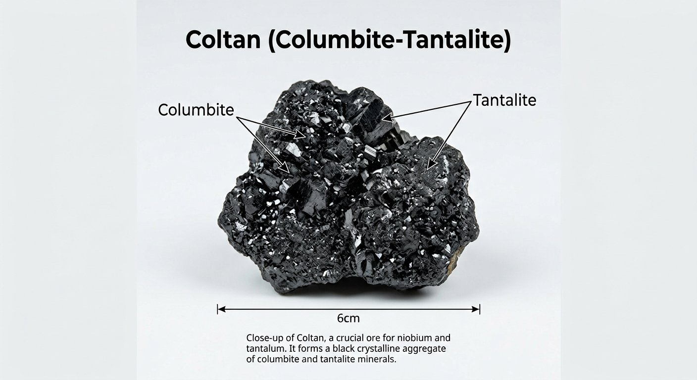

# Columbite–Tantalite (Coltan)

> **Group:** Metallic (oxide) · **Formula:** (Fe,Mn)(Nb,Ta)₂O₆ · **Elements:** Niobium (Nb), Tantalum (Ta)
> **Quick ID:** Iron-black, hardness 6–6.5, submetallic, heavy (SG ~5–8); black grains with cassiterite in pegmatite.

## At a glance

| Property | Value |
|---|---|
| Colour | Iron-black to brownish-black |
| Streak | Black to dark grey |
| Lustre | Submetallic |
| Hardness | 6–6.5 |
| Specific gravity | ~5–8 (rises with Ta content) |
| Cleavage | Distinct (subconchoidal) |
| Crystal system | Orthorhombic |
| Key test | Heavy black grains + cassiterite in pegmatite |

## Chemistry & mineralogy
A **solid-solution series**: **columbite** (Nb-rich) → **tantalite** (Ta-rich). Together marketed as "**coltan**." An oxide of niobium and tantalum. Niobium and tantalum are chemically very similar "twins" — hard to separate, and highly valuable.

## Crystal habit
**Orthorhombic** — short, stubby prismatic crystals, often in parallel groups, or **massive/granular**. In hand specimen it usually appears as dense black masses or grains rather than well-formed crystals.

## Physical properties
- **Hardness 6–6.5.**
- **Lustre:** submetallic; **colour** iron-black to brownish-black.
- **Streak** black to dark grey.
- **Heavy** — specific gravity rises with Ta content (~5–8).
- Often occurs with **cassiterite** in the same rock.

## How to identify in the field
1. **Weight & colour:** heavy (SG 5–8), iron-black grains.
2. **Hardness:** 6–6.5 (scratches glass).
3. **Streak:** black to dark grey.
4. **Association:** with **cassiterite** (tin) in pegmatite — the classic pairing.
5. **Setting:** zoned rare-element pegmatites.

## Lookalikes & how to distinguish

| Looks like | How to tell it apart |
|---|---|
| **Cassiterite** | Cassiterite has a white-grey streak and adamantine lustre; columbite has a black streak. |
| **Magnetite** | Magnetite is strongly magnetic; columbite is not. |
| **Wolframite** | Wolframite is heavier (SG ~7–7.5) with one perfect cleavage; columbite is slightly less dense. |

## Occurrence

**Pure specimen:**

*Figure III.A.2a — Columbite–tantalite: dark, massive black mineral. Source: [USGS](https://usgs.gov/media/images/columbite-tantalite-sample-1).*

**In rock / ore** (small brown-black fragments in a pegmatite):

*Figure III.A.2b — Columbite in rock: brown-black fragments in a pegmatite fragment. Source: [geology.cochise.edu](https://geology.cochise.edu/mineral-type/columbite/).*

*Figure III.A.2c — Columbite–tantalite crystals in matrix. Source: [USGS](https://usgs.gov/media/images/columbite-tantalite-sample-1).*

*Figure III.A.2d — Columbite–tantalite (coltan) hand specimen. Source: [eBay](https://www.ebay.com/b/columbite/bn_7024865223).*

*Figure III.A.2e — Labeled illustration: columbite-tantalite (coltan) crystals in granite. Original diagram prepared for this guide.*

*Figure III.A.2f — Labeled illustration: coltan aggregate of columbite and tantalite. Original diagram prepared for this guide.*

## Genesis
Concentrated by **magmatic and hydrothermal processes** in **rare-element pegmatites** — typically in the zoned interiors of pegmatites, alongside cassiterite, tourmaline, and lithium minerals. The zoned structure of pegmatites concentrates Nb–Ta in specific zones.

## States / localities
**Jos Plateau** (**Plateau**), plus pegmatite fields in **Nasarawa, Kaduna, Bauchi, Kogi, Oyo**. Nigeria has significant coltan potential in the Younger Granite pegmatites.

## Associated minerals & host rocks
Cassiterite, wolframite, tourmaline, beryl, spodumene/lepidolite (lithium), zircon, monazite; hosted by **zoned rare-element pegmatites** (see [Pegmatite](../../02-rocks-of-nigeria/igneous/pegmatite.md)).

## Mining, uses & market
- **Niobium** — high-strength steel alloys, superalloys, jet engines.
- **Tantalum** — compact, high-performance **capacitors** for electronics (phones, laptops); a strategically important and price-volatile "conflict mineral."
- "**Coltan**" mining is a major (and often artisanal) activity in several African countries.

## Exploration notes
- Map and sample **zoned pegmatites** around the **Younger Granites**.
- **Heavy-mineral/panning** and **radiometrics** (columbite is often associated with U/Th minerals) are effective tools.
- Black, heavy grains with cassiterite are the classic association.

## Field checklist
- [ ] Heavy iron-black grains (SG 5–8)?
- [ ] Scratches glass (6–6.5)?
- [ ] Black streak (not white-grey)?
- [ ] With cassiterite in a pegmatite?
- [ ] Zoned pegmatite near granite?

## Facts
- "**Coltan**" (columbite–tantalite) is a strategic "**conflict mineral**" — tantalum powers phone/laptop capacitors.
- **Niobium and tantalum** are chemical twins, extremely hard to separate.
- Nigeria's coltan occurs in the **Younger Granite pegmatites** (Jos Plateau).
- It almost always occurs **with cassiterite (tin)** in the same pegmatite.

## Related
- [Cassiterite](cassiterite.md) · [Pegmatite](../../02-rocks-of-nigeria/igneous/pegmatite.md) · [Lithium](lithium.md) · [Zircon & Monazite](zircon-monazite.md) · [The Younger Granites](../../01-general-geology/01-03-younger-granite-ring-complexes.md)
