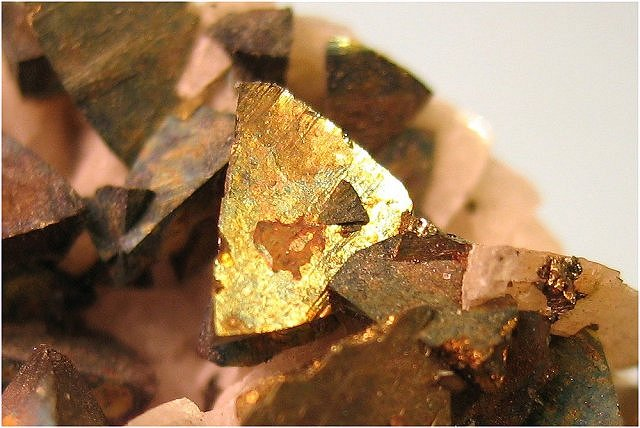
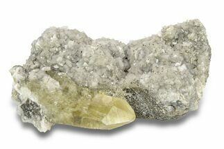

# Copper (Chalcopyrite Ore)

## Chemistry & mineralogy
Copper occurs as **native copper** (Cu) and, more importantly, sulfide ores:
**chalcopyrite** CuFeS₂, **bornite** Cu₅FeS₄, **chalcocite** Cu₂S, plus green secondary
carbonates **malachite** & **azurite**.

## Crystal habit
- **Chalcopyrite:** tetrahedral crystals, often massive/compact.
- **Native copper:** dendritic, wire-like, or irregular masses.

## Physical properties & how to test
- **Chalcopyrite:** brassy yellow (greenish tint), hardness 3½–4 (softer than pyrite),
  greenish-black streak; **brittle** (not malleable) — the key test separating it from gold.
- **Native copper:** reddish-orange, malleable, conducts electricity; tarnishes green.
- **Malachite:** bright green, fizzes faintly (carbonate).

## Occurrence
**Pure / hand specimen**

*Figure III.A.17 — Chalcopyrite, brassy tetragonal crystals (the main copper ore). Source: [Cochise College geology](https://geology.cochise.edu/mineral-type/chalcopyrite).*

**In rock / ore**

*Figure III.A.18 — Chalcopyrite crystals on dolomite. Source: [Fossilera](https://fossilera.com/minerals/4-1-glimmering-chalcopyrite-calcite-missouri).*

## Genesis
Hydrothermal veins, **volcanogenic massive sulfide (VMS)** and **porphyry** systems,
with **secondary enrichment** (chalcocite) near the surface.

## States / localities
**Plateau, Bauchi, Zamfara, Nasarawa** — occurrences in Younger Granites and schist
belts; Nigerian copper is mostly **sub-economic** but a useful byproduct.

## Mining, uses & market
- **Uses:** electrical wiring, electronics, plumbing, alloys (brass, bronze).
- **Market:** copper is high-value & strategic; often recovered with Pb–Zn–Au.

## Exploration notes
- Rusty **gossans** with bright-green **malachite** staining are prime indicators.
- **Geochem (Cu ± Pb, Zn, Au, Ag)**; distinguish chalcopyrite from pyrite (softer, greener).
- Commonly associated with [Galena & Sphalerite](../metallic/galena-sphalerite.md) and [Gold](../metallic/gold.md).

## Related
- [Hand-specimen tests](../../05-field-identification/05-02-hand-specimen-tests.md) · [Galena & Sphalerite](../metallic/galena-sphalerite.md) · [Pyrite & Marcasite](../industrial/pyrite-marcasite.md) · [Silver](../metallic/silver.md)
