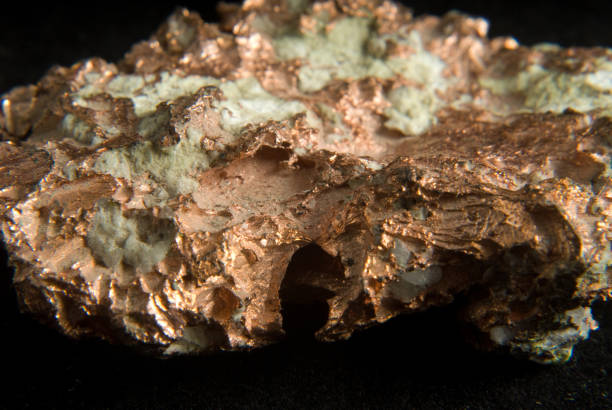
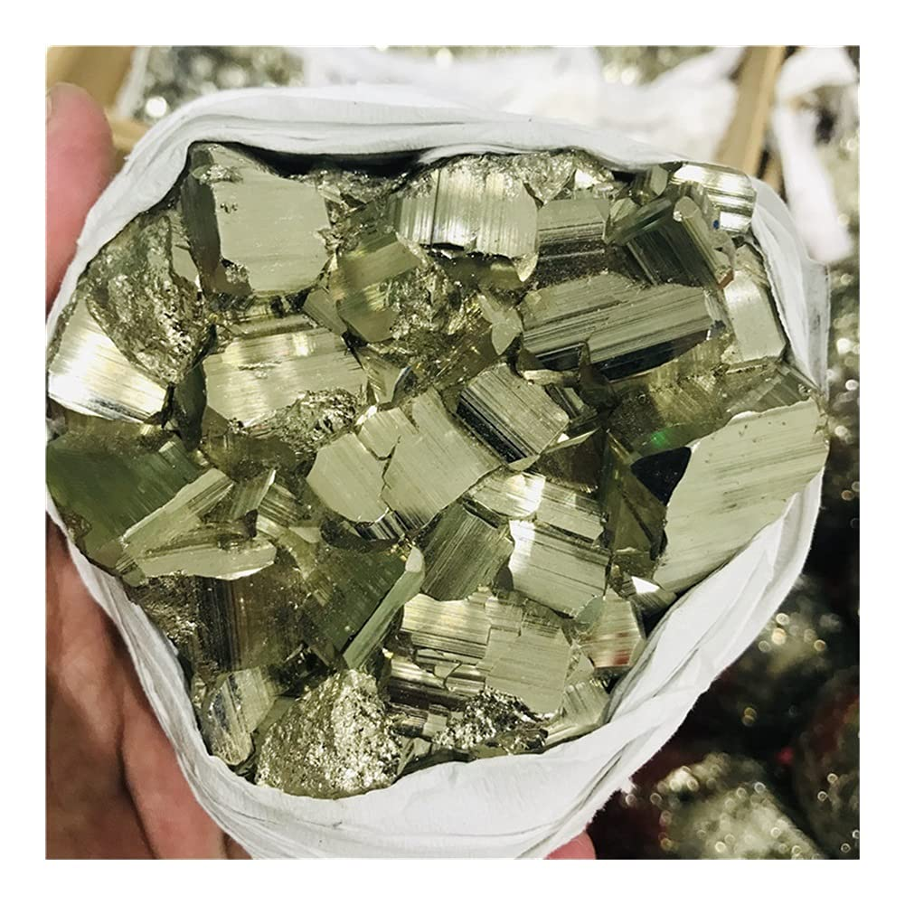

# Copper (Chalcopyrite Ore)

> **Group:** Metallic (sulfide / native) · **Formulas:** Chalcopyrite CuFeS₂ · Bornite Cu₅FeS₄ · Chalcocite Cu₂S · Native Cu
> **Quick ID:** Brassy-yellow **chalcopyrite** (brittle, greenish-black streak) or reddish malleable **native copper**; bright-green **malachite** staining is the giveaway.

## At a glance

| Property | Chalcopyrite | Native copper | Malachite |
|---|---|---|---|
| Colour | Brassy yellow (green tint) | Reddish-orange | Bright green |
| Streak | Greenish-black | Copper-red | Pale green |
| Hardness | 3.5–4 | 2.5–3 | 3.5–4 |
| Behaviour | **Brittle** | **Malleable**, conductive | Fizzes faintly (carbonate) |
| Key test | Brassy + brittle | Reddish + malleable | Green + fizzes |

## Chemistry & mineralogy
Copper occurs as **native copper** (Cu) and, more importantly, sulfide ores: **chalcopyrite** CuFeS₂, **bornite** Cu₅FeS₄, **chalcocite** Cu₂S, plus green secondary carbonates **malachite** & **azurite**. Chalcopyrite is by far the most important copper ore.

## Crystal habit
- **Chalcopyrite:** tetrahedral crystals, often massive/compact.
- **Native copper:** dendritic, wire-like, or irregular masses.
- **Malachite:** botryoidal or banded crusts.

## Physical properties
- **Chalcopyrite:** brassy yellow (greenish tint), hardness 3.5–4 (softer than pyrite), greenish-black streak; **brittle** (not malleable) — the key test separating it from gold.
- **Native copper:** reddish-orange, malleable, conducts electricity; tarnishes green.
- **Malachite:** bright green, fizzes faintly (carbonate).

## How to identify in the field
1. **Chalcopyrite:** brassy yellow but **brittle** (crumbles) and softer than pyrite — vs gold (malleable).
2. **Streak:** chalcopyrite gives a greenish-black streak; pyrite is greenish-black too, but chalcopyrite is softer and more yellow-green.
3. **Native copper:** reddish, malleable, tarnishes green — unmistakable.
4. **Malachite:** bright green + faint acid fizz — a sure sign of copper.
5. **Setting:** gossans and veins with green staining.

## Lookalikes & how to distinguish

| Looks like | How to tell it apart |
|---|---|
| **Pyrite** | Pyrite is harder (6–6.5) and paler; chalcopyrite is softer (3.5–4), greener, and tarnishes. |
| **Gold** | Gold is golden, malleable, and very heavy; chalcopyrite is brassy-green and brittle. |
| **Bornite** | Bornite ("peacock ore") is purple-iridescent; chalcopyrite is brassy. |

## Occurrence

**Pure / hand specimen**

*Figure III.A.17 — Chalcopyrite, brassy crystals (the main copper ore). Source: [Cochise College geology](https://geology.cochise.edu/mineral-type/chalcopyrite).*

**In rock / ore**

*Figure III.A.18 — Chalcopyrite crystals on dolomite. Source: [Fossilera](https://fossilera.com/minerals/4-1-glimmering-chalcopyrite-calcite-missouri).*

*Figure III.A.17b — Chalcopyrite (copper ore) with quartz. Source: [iStock](https://istockphoto.com/photos/chalcopyrite).*

*Figure III.A.17c — Native copper. Source: [Amazon](https://www.amazon.com/RaeGan-Natural-Specimen-Chalcopyrite-Collection/dp/B0CP96XBKF).*

## Genesis
Hydrothermal veins, **volcanogenic massive sulfide (VMS)** and **porphyry** systems, with **secondary enrichment** (chalcocite) near the surface. In Nigeria, copper occurs in Younger Granite-related and schist-belt settings.

## States / localities
**Plateau, Bauchi, Zamfara, Nasarawa** — occurrences in Younger Granites and schist belts; Nigerian copper is mostly **sub-economic** but a useful byproduct (recovered with Pb–Zn–Au).

## Associated minerals & host rocks
Galena, sphalerite, pyrite, gold, silver; hosted by **quartz veins, skarns, and VMS/porphyry systems** (see [Galena & Sphalerite](galena-sphalerite.md), [Skarn](../../02-rocks-of-nigeria/metamorphic/skarn.md)).

## Mining, uses & market
- **Uses:** electrical wiring, electronics, plumbing, alloys (brass, bronze).
- **Market:** copper is high-value & strategic; often recovered with Pb–Zn–Au.
- Demand is soaring with electrification and renewable energy.

## Exploration notes
- Rusty **gossans** with bright-green **malachite** staining are prime indicators.
- **Geochem (Cu ± Pb, Zn, Au, Ag)**; distinguish chalcopyrite from pyrite (softer, greener).
- Commonly associated with [Galena & Sphalerite](galena-sphalerite.md) and [Gold](gold.md).

## Field checklist
- [ ] Brassy (chalcopyrite) or reddish (native copper)?
- [ ] Brittle (chalcopyrite) vs malleable (gold/native copper)?
- [ ] Green malachite staining / fizz?
- [ ] Greenish-black streak (chalcopyrite)?
- [ ] Gossan / vein / skarn setting?

## Facts
- **Malachite's** bright green + faint fizz is a classic field clue for copper.
- Chalcopyrite is **brittle** — the key test separating it from malleable gold.
- Copper **tarnishes green** (malachite) — a natural marker of copper deposits.
- Copper demand is rising fast with **electrification** and clean-energy technology.

## Related
- [Hand-specimen tests](../../05-field-identification/05-02-hand-specimen-tests.md) · [Galena & Sphalerite](galena-sphalerite.md) · [Pyrite & Marcasite](../industrial/pyrite-marcasite.md) · [Silver](silver.md) · [Gold](gold.md) · [Skarn](../../02-rocks-of-nigeria/metamorphic/skarn.md)
