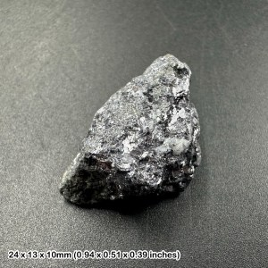
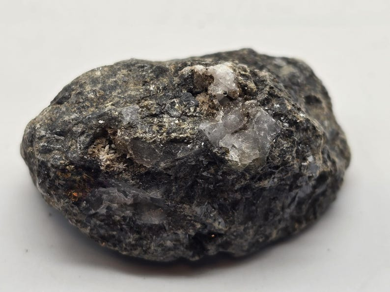
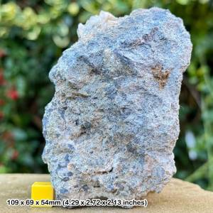
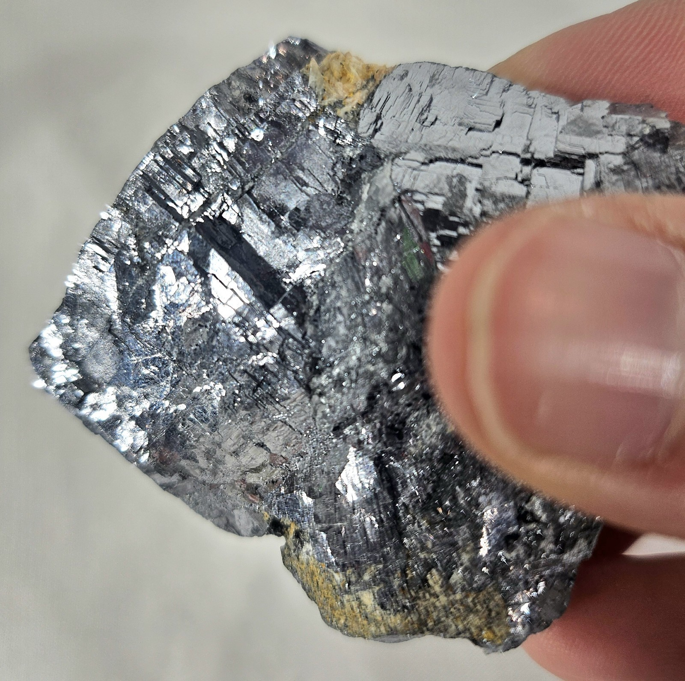

# Galena & Sphalerite (Lead–Zinc Ore)

> **Group:** Metallic (sulfides) · **Formulas:** Galena PbS · Sphalerite ZnS · **Elements:** Lead (Pb), Zinc (Zn)
> **Quick ID:** Galena = lead-grey, **perfect cubic cleavage**, very heavy (SG ~7.5); sphalerite = resinous, brown/yellow, greasy.

## At a glance

| Property | Galena | Sphalerite |
|---|---|---|
| Colour | Lead-grey | Brown, yellow, black |
| Streak | Grey-black | Brown to white |
| Lustre | Metallic | Resinous to adamantine |
| Hardness | 2.5–3 | 3.5–4 |
| Specific gravity | **~7.5** (very heavy) | ~4 |
| Cleavage | **Perfect cubic** (breaks into cubes) | Perfect (6 directions) |
| Key test | Cubic cleavage + heavy + lead-grey | Resinous lustre + greasy |

## Chemistry & mineralogy
- **Galena** — lead sulfide, PbS (often carries **silver**).
- **Sphalerite** — zinc sulfide, ZnS (often with **cadmium, germanium**).
- The two occur together in the same hydrothermal deposits.

## Crystal habit
- **Galena:** **cubic** and octahedral crystals, or coarse/massive; **perfect cubic cleavage** (breaks into little cubes).
- **Sphalerite:** tetrahedral/dodecahedral crystals or massive; resinous.

## Physical properties
- **Galena:** hardness 2.5–3; metallic, lead-grey; **very heavy** (SG ~7.5); grey-black streak; **perfect cubic cleavage** (the giveaway).
- **Sphalerite:** hardness 3.5–4; resinous to adamantine; brown/yellow/black; perfect cleavage; greasy; SG ~4.

## How to identify in the field
1. **Galena:** lead-grey, **very heavy**, and breaks into **perfect cubes** (cubic cleavage) — the giveaway.
2. **Sphalerite:** resinous/greasy lustre, brown-yellow colour, lighter than galena.
3. **Streak:** galena grey-black; sphalerite brown to white.
4. **Association:** galena + sphalerite together in veins.
5. **Setting:** hydrothermal veins/replacements in limestone (Benue).

## Lookalikes & how to distinguish

| Looks like | How to tell it apart |
|---|---|
| **Stibnite** | Stibnite is lead-grey but bladed/fibrous and softer; galena is cubic and heavier. |
| **Scheelite** | Scheelite is pale and fluoresces under UV; galena is lead-grey and cubic. |
| **Arsenopyrite** | Arsenopyrite is harder (5.5–6) and gives a garlic odour when struck; galena is soft (2.5–3) and cubic. |

## Occurrence

**Pure specimens:**

*Figure III.A.5a — Galena: cubic, metallic lead sulfide. Source: [MyLostGems](https://mylostgems.com/product-category/crystals/e-i/galena/).*

*Figure III.A.5b — Sphalerite: resinous zinc sulfide. Source: [Etsy](https://www.etsy.com/listing/765209185/sphalerite-zinc-sulfide-mineral-10).*

*Figure III.A.5c — Galena specimen (with scale). Source: [MyLostGems](https://mylostgems.com/product-category/crystals/e-i/galena/).*

*Figure III.A.5d — Galena crystals showing bright cleavage planes. Source: [eBay](https://www.ebay.com/itm/306731310964).*

**In rock:** hydrothermal **veins and replacements** in the **Benue Trough**, hosted by limestone and shale (see [Limestone](../../02-rocks-of-nigeria/sedimentary/limestone.md)).

## Genesis
**Hydrothermal** fluids (Mississippi-Valley-type and skarn-related) depositing Pb–Zn in fractures and carbonate rocks of the **Benue Trough**. Metal-rich fluids migrated through limestone, replacing it with galena and sphalerite.

## States / localities
**Enugu (Abakaliki, Ishiagu), Ebonyi, Plateau (Zurak), Benue, Kogi, Cross River** — the classic Benue lead–zinc districts. The **Abakaliki–Ishiagu** area is Nigeria's main Pb–Zn region.

## Associated minerals & host rocks
Silver, pyrite, chalcopyrite, quartz, calcite, barite; hosted by **limestone and shale** of the Benue Trough (see [Skarn](../../02-rocks-of-nigeria/metamorphic/skarn.md)).

## Mining, uses & market
- **Lead** — batteries, radiation shielding, ammunition, pigments.
- **Zinc** — galvanizing (rust protection), brass/bronze alloys, die-casting.
- **Silver** is a valuable by-product of some galena.

## Exploration notes
- Follow **rusty gossans** (weathered sulfide caps) and **quartz/calcite veins** in the Benue limestones/shales.
- **Soil geochemistry** for **Pb, Zn, (Ag, Cu)** is highly effective.
- Field clue: **very heavy, cubic-cleaving grey mineral** (galena) with resinous sphalerite.

## Field checklist
- [ ] Lead-grey + perfect cubic cleavage + heavy (galena)?
- [ ] Resinous brown/yellow, greasy (sphalerite)?
- [ ] Galena + sphalerite together?
- [ ] In Benue limestone/shale?
- [ ] Rusty gossans / quartz-calcite veins?

## Facts
- **Galena's perfect cubic cleavage** and extreme weight (SG ~7.5) make it unmistakable.
- The **Abakaliki–Ishiagu** area (Enugu/Ebonyi) is Nigeria's main lead–zinc district.
- **Silver** is often a valuable by-product of galena.
- **Sphalerite** is the world's main **zinc** ore (essential for galvanizing steel).

## Related
- [Limestone](../../02-rocks-of-nigeria/sedimentary/limestone.md) · [The Benue Trough](../../01-general-geology/01-04-sedimentary-basins.md) · [Ore deposits 101](../../00-fundamentals/00-07-ore-deposits-101.md) · [Silver](silver.md) · [Barite](barite.md)
