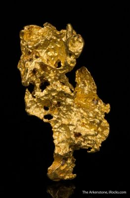
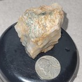
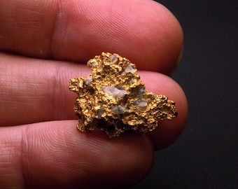
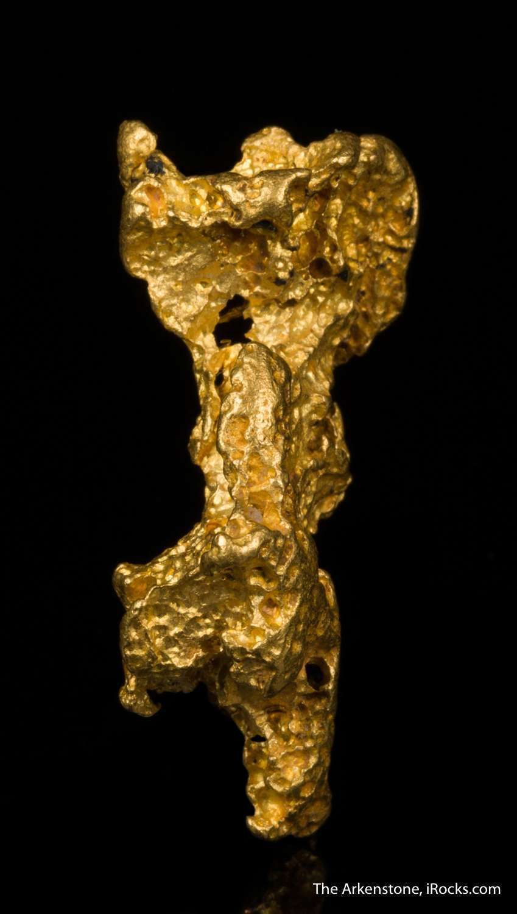

# Gold

> **Group:** Metallic (native element) · **Formula:** Au (usually Au–Ag alloy, "electrum") · **Element:** Gold
> **Quick ID:** Very heavy (SG ~19), soft (2.5–3), malleable, golden-yellow, non-tarnishing; NOT brittle (unlike "fool's gold").

## At a glance

| Property | Value |
|---|---|
| Colour | Golden-yellow (paler with more silver) |
| Streak | Golden-yellow |
| Lustre | Metallic |
| Hardness | 2.5–3 (scratched by a knife) |
| Specific gravity | **~15–19** (very heavy) |
| Cleavage | None; **malleable** (flattens, doesn't crumble) |
| Magnetism | None |
| Crystal system | Isometric (crystals rare) |
| Key test | Heavy + malleable + golden + no tarnish |

## Chemistry & mineralogy
**Native gold** — Au, usually alloyed with some **silver** (electrum). Occurs native (not as a compound), often with minor Ag, Cu. Purity is measured in **fineness** (parts per thousand gold); pure gold is 24-**karat**. Silver content pales the colour and lowers the density.

## Crystal habit
Well-formed crystals are **rare**; gold usually appears as **nuggets, flakes, grains, or wire/dendritic** forms in veins. Crystal habit is seldom useful for ID — colour, weight, and malleability are.

## Physical properties
- **Hardness 2.5–3** — can be scratched by a knife; very **malleable** (a hammer flattens it).
- **Lustre:** metallic; **colour** golden-yellow (paler with more silver).
- **Very heavy** — specific gravity ~19 (much heavier than it looks).
- **Streak** golden-yellow; does **not** tarnish (unlike pyrite "fool's gold").
- Ductile (can be drawn into wire) and an excellent conductor of electricity.

## How to identify in the field
1. **Weight:** extraordinarily heavy for its size (SG ~19) — it "feels" like lead or heavier.
2. **Malleability:** hammer or squeeze — gold **flattens/bends**; pyrite and chalcopyrite **crumble**.
3. **Colour:** golden-yellow; pyrite is paler/brassier and tarnishes.
4. **Streak:** golden-yellow (pyrite gives a greenish-black streak).
5. **Tarnish:** gold stays bright; pyrite dulls/tarnishes.

## Lookalikes & how to distinguish

| Looks like | How to tell it's gold |
|---|---|
| **Pyrite ("fool's gold")** | Pyrite is harder (6–6.5), **brittle** (crumbles), greenish-black streak, tarnishes. Gold is soft, malleable, golden streak, no tarnish. |
| **Chalcopyrite** | Chalcopyrite is brassy-green, brittle, softer streak; gold is golden and malleable. |
| **Muscovite / biotite flakes** | Micas are light, flaky, and cleave into sheets; gold is heavy and metallic. |

## Occurrence

**Pure specimen (nugget):**

*Figure III.A.3a — Native gold nugget. Source: [iRocks](https://www.irocks.com/galleries/native-gold-crystals-nuggets-leaf-natural).*

**In rock / ore** (gold in a quartz vein):

*Figure III.A.3b — Gold ore: native gold in a quartz (sulfide) vein. Source: [eBay](https://www.ebay.com/shop/gold-quartz-vein?_nkw=gold+quartz+vein).*

*Figure III.A.3c — Gold nugget (with quartz) held in a hand. Source: [Etsy](https://www.etsy.com/listing/1396793398/crystallized-gold-nugget-native-metal).*

*Figure III.A.3d — Crystalline native gold (wire / nugget form). Source: [iRocks](https://www.irocks.com/minerals/specimen/45325).*

## Genesis
Two main settings in Nigeria:
- **Hydrothermal quartz veins** in the **schist belts** (hard-rock/lode gold) — the primary target.
- **Placer gold** — weathered out of veins and concentrated in rivers and soils (the easiest to mine).

## States / localities
Major artisanal and lode gold areas: **Zamfara (Maru, Anka, Bunkunu), Kebbi, Osun (Ilesa), Niger, Kaduna, Kwara, Ebonyi, Kogi, Oyo, Sokoto**. Artisanal mining is widespread and growing.

## Associated minerals & host rocks
Quartz (the vein host), **pyrite, arsenopyrite** (sulfides), silver; host rocks are the **mica schist/phyllite and greenschist** of the schist belts (see [Mica schist](../../02-rocks-of-nigeria/metamorphic/mica-schist-phyllite.md)).

## Mining, uses & market
Recovered by **panning, gravity concentration, and (for lode) crushing + leaching** (cyanide/mercury). Gold is prized for **jewelry, investment/reserves, and electronics**. Nigeria's gold is largely artisanal — a strategic, high-value resource.

## Exploration notes
- **Pan streams** and follow gold upstream to its source.
- **Soil/rock geochemistry** for **Au + pathfinders (As, Sb)**.
- In the schist belts, **follow quartz veins** and rusty **gossans**.
- Tell-tale: soft, very heavy, golden-yellow, non-tarnishing metal.

## Field checklist
- [ ] Very heavy for its size?
- [ ] Malleable (flattens, not brittle)?
- [ ] Golden-yellow colour + streak?
- [ ] No tarnish?
- [ ] In a quartz vein / stream placer?

## Facts
- Gold's **specific gravity (~19)** makes it feel remarkably heavy — a key field clue.
- **Pyrite** ("fool's gold") is the classic impostor — harder, brittle, and tarnishes.
- Nigeria's gold is mostly **artisanal**, concentrated in the **schist belts** (Zamfara, Kebbi, Osun).
- Gold is so **malleable** it can be beaten into translucent leaf.

## Related
- [Mica schist & Phyllite](../../02-rocks-of-nigeria/metamorphic/mica-schist-phyllite.md) · [Placers & alluvium](../../02-rocks-of-nigeria/sedimentary/placers-alluvium.md) · [Galena & Sphalerite](galena-sphalerite.md) · [Pyrite & Marcasite](../industrial/pyrite-marcasite.md) · [Hand-specimen tests](../../05-field-identification/05-02-hand-specimen-tests.md)
