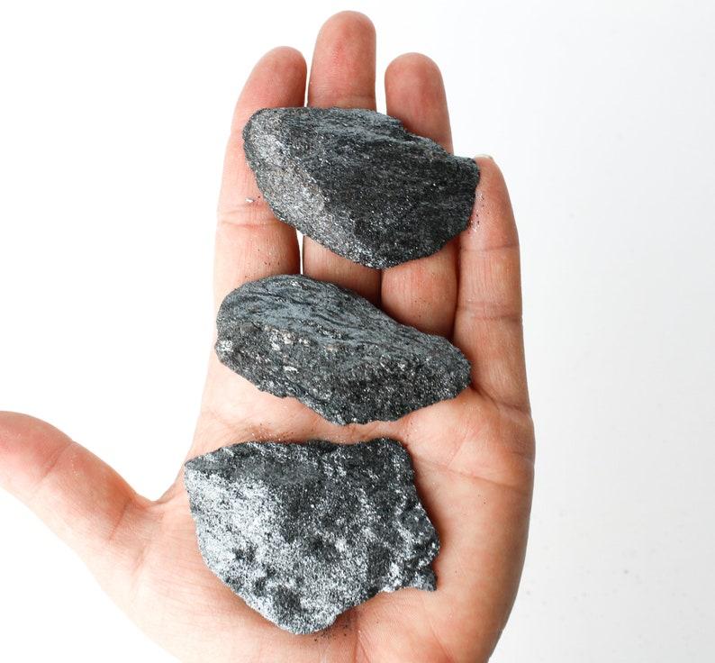
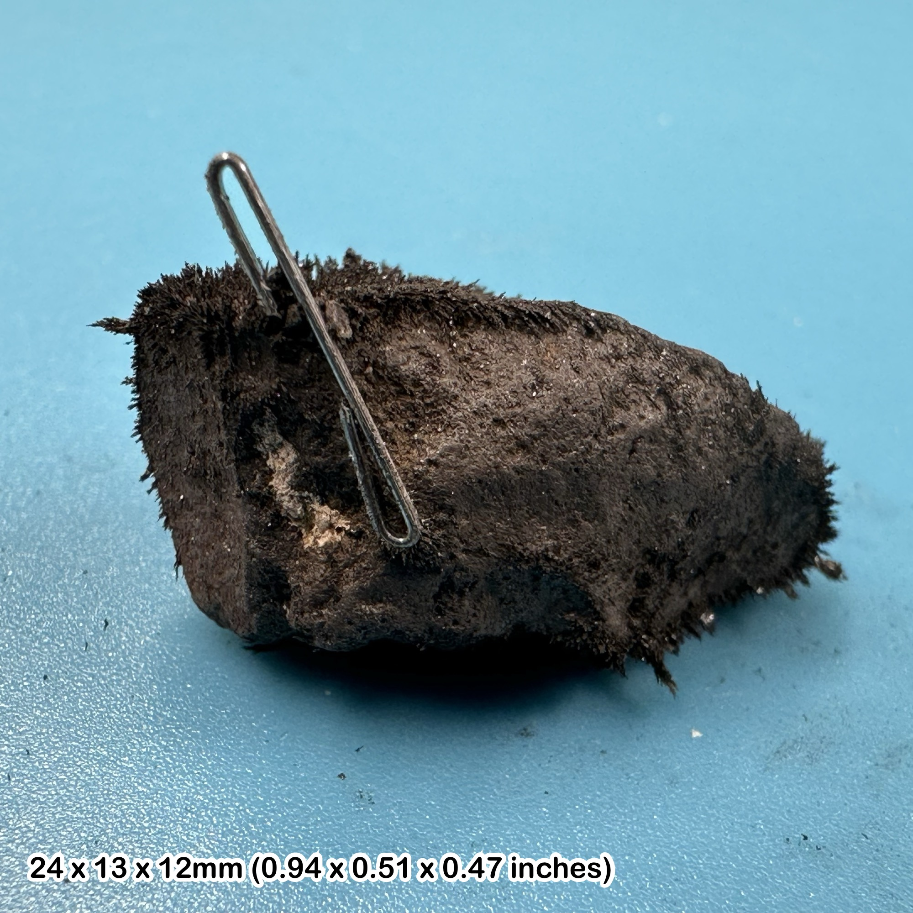
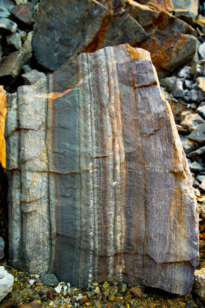
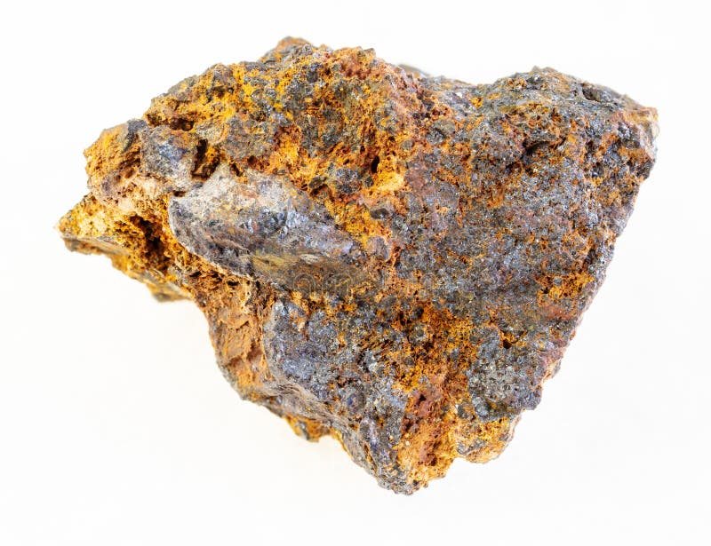
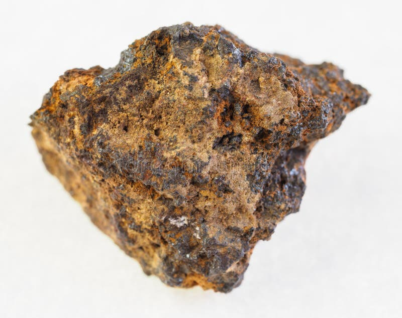

# Iron Ore (Hematite & Magnetite)

> **Group:** Metallic (oxide) · **Formulas:** Hematite Fe₂O₃ · Magnetite Fe₃O₄ · **Element:** Iron (Fe)
> **Quick ID:** Heavy, red-brown (hematite) or black magnetic (magnetite); **red-brown streak** = hematite, **magnet sticks** = magnetite.

## At a glance

| Property | Hematite | Magnetite |
|---|---|---|
| Colour | Steel-grey to red-brown (earthy) | Black |
| Streak | **Red-brown** (diagnostic) | **Black** |
| Lustre | Metallic to earthy | Metallic |
| Hardness | 5.5–6.5 | ~6 |
| Specific gravity | ~5.3 | ~5.2 |
| Magnetism | Usually non-magnetic | **Strongly magnetic** (lodestone) |
| Key test | Red-brown streak | Magnet sticks |

## Chemistry & mineralogy
- **Hematite** — Fe₂O₃ (iron oxide); earthy, specular, or oolitic forms.
- **Magnetite** — Fe₃O₄ (iron oxide, spinel group); strongly magnetic.

Both are iron oxides; together they are the world's main **iron ores**. Goethite/limonite (hydrated iron oxide) is a common near-surface form.

## Crystal habit
- **Hematite:** tabular/rhombohedral crystals, botryoidal (kidney ore), micaceous (**specular**), or earthy/oolitic.
- **Magnetite:** octahedral crystals or massive/granular.

## Physical properties
- **Hematite:** hardness 5.5–6.5; metallic to earthy; **red-brown streak**; usually **non-magnetic**; earthy varieties are red ("red ochre").
- **Magnetite:** hardness ~6; black; **black streak**; **strongly magnetic** (a magnet sticks; "**lodestone**" is naturally magnetic magnetite); heavy.

## How to identify in the field
1. **Streak:** rub on unglazed porcelain — **red-brown** = hematite; **black** = magnetite.
2. **Magnet:** if a magnet sticks strongly → **magnetite**.
3. **Weight:** both are heavy (SG ~5.2).
4. **Colour/lustre:** metallic grey (specular hematite) or earthy red (hematite); black (magnetite).
5. **Context:** BIF/oolitic beds or lateritic concentration.

## Lookalikes & how to distinguish

| Looks like | How to tell it apart |
|---|---|
| **Magnetite vs hematite** | Magnetite is magnetic with a black streak; hematite is usually non-magnetic with a red-brown streak. |
| **Limonite/goethite** | Limonite is yellowish-brown with a yellowish streak; hematite is redder (red-brown streak). |
| **Chromite** | Chromite is brownish-black with a brown streak (and in ultramafics); hematite is red-brown, magnetite black/magnetic. |

## Occurrence

**Pure specimens** (specular hematite; magnetic magnetite):

*Figure III.A.4a — Specular hematite: micaceous, metallic iron oxide. Source: [Etsy](https://www.etsy.com/in-en/listing/1005354636/specular-hematite-raw-mineral-specimen).*

*Figure III.A.4b — Magnetite: black, strongly magnetic iron oxide (lodestone). Source: [MyLostGems](https://mylostgems.com/product/lodestone-magnetite-magnetic-stone-healing-crystal-stone-genuine/).*

**In rock** (banded iron formation / oolitic ironstone):

*Figure III.A.4c — Banded iron formation: alternating iron-rich and silica layers. Source: [iStock](https://www.istockphoto.com/photos/banded-iron).*

*Figure III.A.4d — Botryoidal hematite (kidney ore). Source: [Fossilera Minerals](https://www.fossilageminerals.com/products/2-1-hematite-botryoidal-kidney-ore-rock-mineral-specimen-irhoud-mine-morocco-03aaa226).*

*Figure III.A.4e — Hematite botryoidal specimen (Morocco). Source: [Fossilera Minerals](https://www.fossilageminerals.com/products/2-1-hematite-botryoidal-kidney-ore-rock-mineral-specimen-irhoud-mine-morocco-03aaa226).*

## Genesis
- **Sedimentary** — banded iron formations (BIF) and oolitic ironstones.
- **Lateritic enrichment** — tropical weathering concentrates iron (lateritic iron).
- **Magmatic/hydrothermal** — magnetite in some mafic rocks and skarns.

## States / localities
- **Kogi** — **Itakpe** (the famous Itakpe Hill iron-ore ridge, feeding the Ajaokuta steel complex), **Agbaja**, **Ajabanoko**.
- Also **Enugu, Nasarawa, Kogi**, and lateritic iron across the Basement.

## Associated minerals & host rocks
Quartz, chamosite, goethite/limonite; phosphorus in some ores; hosted by **banded iron formation, oolitic ironstone, and laterite** (see [Ironstone](../../02-rocks-of-nigeria/sedimentary/ironstone.md)).

## Mining, uses & market
The **raw material for steel** — Nigeria's strategic iron deposits feed the **Ajaokuta/Itakpe steel industry**. Iron is the backbone of construction and manufacturing and the most-used metal on Earth.

## Exploration notes
- **Magnetometry** is the classic tool — magnetite/BIF give strong magnetic anomalies.
- Look for **heavy, reddish (hematite) or black magnetic (magnetite)** rock and ridges; the **red-brown streak** and **magnet test** are decisive in the field.

## Field checklist
- [ ] Heavy (SG ~5)?
- [ ] Red-brown streak (hematite) or black + magnetic (magnetite)?
- [ ] Metallic or earthy lustre?
- [ ] BIF / oolitic / lateritic setting?
- [ ] Magnet sticks (magnetite)?

## Facts
- The **Itakpe Hill** (Kogi) ore feeds the **Ajaokuta steel complex** — Nigeria's flagship steel project.
- **Magnetite** is the most magnetic natural mineral — "**lodestone**" was the first compass.
- **Hematite's red-brown streak** is one of the most reliable mineral ID tests.
- **Banded iron formations** record the rise of oxygen in Earth's early atmosphere.

## Related
- [Ironstone (rock)](../../02-rocks-of-nigeria/sedimentary/ironstone.md) · [Laterite & Ferricrete](../../02-rocks-of-nigeria/sedimentary/laterite-ferricrete.md) · [The sedimentary basins](../../01-general-geology/01-04-sedimentary-basins.md)
