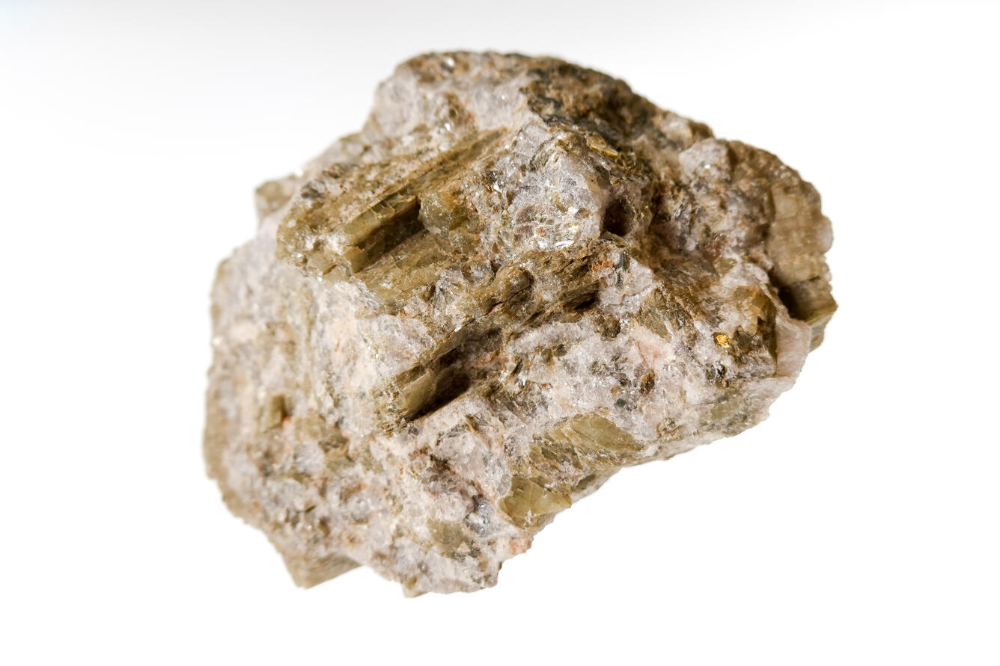
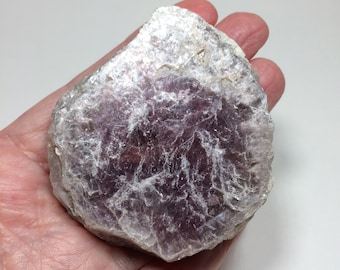

# Lithium in Pegmatites (Spodumene & Lepidolite)

> **Group:** Industrial/metallic · **Minerals:** Spodumene LiAlSi₂O₆ · Lepidolite · **Element:** Lithium (Li)

## Chemistry & mineralogy
- **Spodumene** — a lithium **pyroxene**, LiAlSi₂O₆.
- **Lepidolite** — a lithium-rich **mica**.
Both are important **lithium ore minerals**, hosted in rare-element **pegmatites**.

## Crystal habit
**Spodumene:** prismatic, often **very large** (can be metres long); may be gemmy
(kunzite = pink, hiddenite = green). **Lepidolite:** foliated, book-like mica.

## Physical properties & how to test
- **Spodumene:** hardness 6.5–7; white/grey/green; perfect cleavage; heavy.
- **Lepidolite:** hardness 2.5–4; soft, **lilac/pink** mica (peels into sheets).

## Occurrence

**Pure specimens:**

*Figure III.A.14a — Spodumene: lithium pyroxene. Source: [USGS](https://usgs.gov/media/images/spodumene-specimen).*

*Figure III.A.14b — Lepidolite: lithium-rich mica. Source: [Etsy](https://www.etsy.com/listing/902572170/black-mica-on-quartz-black-lepidolite).*

**In rock:** in **zoned rare-element pegmatites**, alongside **columbite, tantalite,
tourmaline, and beryl** (see [Pegmatite](../../02-rocks-of-nigeria/igneous/pegmatite.md)).

## Genesis
**Magmatic–hydrothermal**, concentrated in the late, element-rich zones of
**pegmatites** associated with the Younger Granites and older granitoids.

## States / localities
Pegmatite fields: **Plateau (Jos), Nasarawa, Kaduna, Bauchi, Oyo, Kogi**. Lithium is
an **emerging** target in Nigerian pegmatites (sometimes called the new "white
petroleum").

## Mining, uses & market
The key ingredient in **rechargeable batteries** (EVs, phones, grid storage) — demand
is booming. Also used in ceramics, glass, and greases; **kunzite/hiddenite** are gems.

## Exploration notes
- Map and sample **zoned pegmatites** — Li concentrates in specific zones.
- Look for **spodumene (white/green prisms)** and **lepidolite (pink mica)**.
- Often co-located with **columbite-tantalite** (see [Columbite–Tantalite](columbite-tantalite.md)).

## Related
- [Pegmatite](../../02-rocks-of-nigeria/igneous/pegmatite.md) · [Columbite–Tantalite](columbite-tantalite.md) · [The Younger Granites](../../01-general-geology/01-03-younger-granite-ring-complexes.md)
