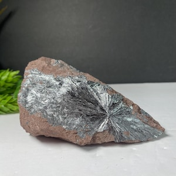
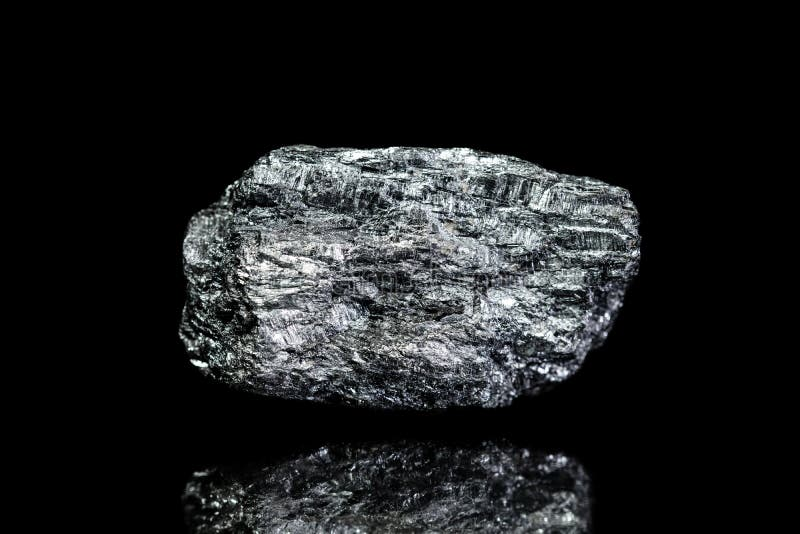
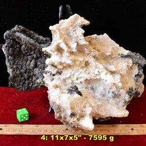
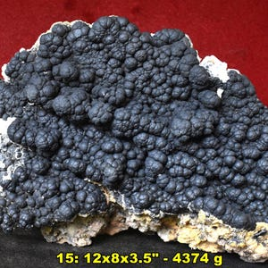

# Manganese Ores

> **Group:** Metallic (oxide/hydroxide) · **Minerals:** Pyrolusite (MnO₂), psilomelane · **Element:** Manganese (Mn)
> **Quick ID:** Black to steel-grey, **streak black**, often **dendritic (tree-like)** or botryoidal; distinguished from iron ores by the black streak.

## At a glance

| Property | Value |
|---|---|
| Colour | Black to dark steel-grey |
| Streak | **Black** (diagnostic) |
| Lustre | Metallic to dull; often dendritic |
| Hardness | Variable (pyrolusite ~2–6; soft ones soil fingers) |
| Habit | Acicular/dendritic (pyrolusite); botryoidal (psilomelane) |
| Key test | Black + black streak + dendritic/botryoidal |

## Chemistry & mineralogy
Chiefly **pyrolusite** (MnO₂) and related oxides/hydroxides (psilomelane, manganite, braunite). Often mixed with iron oxides in the field. Manganese is chemically similar to iron and commonly occurs with it.

## Crystal habit
**Pyrolusite:** prismatic/acicular sprays, dendritic, or massive. **Psilomelane:** botryoidal (grape-like) or stalactitic. Dendritic (branching, tree-like) coatings on rock surfaces are a common field sight.

## Physical properties
- **Hardness:** variable (pyrolusite ~2–6; soft ones soil the fingers when rubbed).
- **Colour:** black to dark steel-grey; **streak black**.
- **Lustre:** metallic to dull; often **dendritic** (tree-like) coatings.
- Heavy; black streak distinguishes it from look-alikes.

## How to identify in the field
1. **Streak:** **black** streak (hematite is red-brown; limonite yellow-brown).
2. **Colour:** black to steel-grey.
3. **Habit:** dendritic (tree-like) or botryoidal (grape-like).
4. **Feel:** soft varieties soil the fingers (like a soft pencil).
5. **Context:** weathered zones, veins, sedimentary beds.

## Lookalikes & how to distinguish

| Looks like | How to tell it apart |
|---|---|
| **Hematite** | Hematite has a red-brown streak; manganese oxides have a black streak. |
| **Limonite/goethite** | Limonite has a yellowish-brown streak; manganese is black. |
| **Magnetite** | Magnetite is strongly magnetic; manganese oxides are not. |

## Occurrence

**Pure specimen** (silvery acicular pyrolusite):

*Figure III.A.7a — Pyrolusite: acicular manganese oxide. Source: [Etsy](https://www.etsy.com/market/pyrolusite_mineral_specimen).*

**In rock / ore:**

*Figure III.A.7b — Manganese ore: black Mn-oxide rock. Source: [Dreamstime](https://www.dreamstime.com/photos-images/manganese.html).*

*Figure III.A.7c — Psilomelane (manganese ore) specimen. Source: [Etsy](https://etsy.com/market/pyrolusite_stone).*

*Figure III.A.7d — Psilomelane (manganese ore). Source: [Etsy](https://www.etsy.com/market/pyrolusite_mineral_specimen).*

## Genesis
**Sedimentary, residual (lateritic), and hydrothermal** — Mn oxides concentrate in weathered zones, veins, and sedimentary beds. Tropical weathering (lateritization) is a key concentrator of manganese in Nigeria.

## States / localities
Occurrences in the **Basement and schist belts**: **Kebbi, Katsina, Zamfara, Kaduna, Nasarawa, Plateau, Oyo, Kwara**, and elsewhere. Nigeria's manganese is mostly small-to-medium scale.

## Associated minerals & host rocks
Iron oxides (hematite, goethite), barite (Mn–Ba association), quartz; hosted by **laterite/regolith, veins, and sedimentary beds** (see [Laterite & Ferricrete](../../02-rocks-of-nigeria/sedimentary/laterite-ferricrete.md)).

## Mining, uses & market
Essential in **steelmaking** (deoxidizer/desulfurizer), **batteries** (dry-cell, Li-ion cathodes), **alloys**, **fertilizers**, and **pigments**. Manganese is on many critical-minerals lists.

## Exploration notes
- **Black, streak-black, dendritic or botryoidal** oxides in veins/regolith.
- **Soil/rock geochemistry** for **Mn (+ Fe, Co, Ba)**.
- Distinguish from **hematite/limonite** by the **black streak** (hematite is red-brown).

## Field checklist
- [ ] Black colour + black streak?
- [ ] Dendritic (tree-like) or botryoidal?
- [ ] Soft variety soils fingers?
- [ ] Non-magnetic?
- [ ] Laterite/vein/sedimentary setting?

## Facts
- Manganese's **black streak** separates it from red-streaked hematite.
- **Dendritic** (tree-like) manganese coatings on rocks are a common field clue.
- It is essential in **steelmaking** (removes oxygen and sulfur).
- Manganese is a key **battery** mineral (dry-cell and Li-ion cathodes).

## Related
- [Iron ore](iron-ore.md) · [Laterite & Ferricrete](../../02-rocks-of-nigeria/sedimentary/laterite-ferricrete.md) · [Ore deposits 101](../../00-fundamentals/00-07-ore-deposits-101.md)
