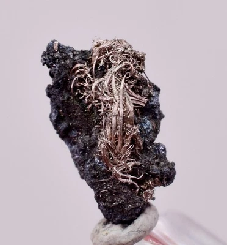
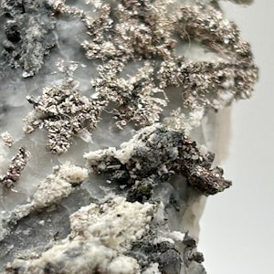

# Silver (Ag)

> **Group:** Metallic (native element / sulfide) · **Minerals:** Native Ag · Argentite Ag₂S · Tetrahedrite · **Element:** Silver (Ag)
> **Quick ID:** Silver-white, **tarnishes black**, soft (2½–3), heavy, malleable; bright silvery streak; tiny specks/wire in galena or gold ore.

## At a glance

| Property | Value |
|---|---|
| Colour | Silver-white; **tarnishes black** |
| Streak | Bright silvery-white |
| Lustre | Metallic |
| Hardness | 2½–3 (soft) |
| Specific gravity | High (heavy) |
| Behaviour | Malleable and ductile |
| Key test | Bright silvery streak + tarnishes + malleable |

## Chemistry & mineralogy
**Native silver** (Ag) and silver minerals — **argentite** Ag₂S, **tetrahedrite**. In Nigeria, silver is recovered mainly **as a byproduct** of lead–zinc and gold ores. Silver has the highest electrical and thermal conductivity of any metal.

## Crystal habit
**Native silver:** wire-like, dendritic, arborescent, or massive. **Argentite:** sooty or massive, often replacing galena. In ore, silver often appears as tiny specks or wire filaments within galena.

## Physical properties
- **Colour:** silver-white; **tarnishes black** on exposure.
- **Hardness:** soft (2½–3); very **heavy**; malleable and ductile.
- **Streak:** bright silvery-white (distinctive).
- Look for it as tiny specks or wire filaments in galena/gold ore.

## How to identify in the field
1. **Streak:** bright silvery-white (very distinctive).
2. **Tarnish:** turns black/dull on exposure (unlike bright platinum).
3. **Malleability:** soft and ductile (can be bent).
4. **Weight:** heavy.
5. **Association:** tiny specks/wire in **galena** or **gold** ore.

## Lookalikes & how to distinguish

| Looks like | How to tell it apart |
|---|---|
| **Platinum** | Platinum is steel-grey, does NOT tarnish, and is harder; silver tarnishes black. |
| **Lead** | Lead is dull grey and very soft; silver is bright silvery-white and malleable. |
| **Bismuth** | Bismuth is brittle and pinkish; silver is malleable and bright. |

## Occurrence

**Pure / hand specimen**

*Figure III.A.19 — Native silver wire specimen (Uchucchacua mine, Peru). Source: [eBay](https://www.ebay.com/b/native-silver/bn_7024858115).*

**In rock / ore**

*Figure III.A.20 — Dendritic native silver on calcite matrix. Source: [Etsy](https://www.etsy.com/market/native_silver_ore_specimens).*

## Genesis
Hydrothermal veins, especially the **enriched / oxidized zones** of lead–zinc and gold systems (see [Galena & Sphalerite](galena-sphalerite.md), [Gold](gold.md)). Silver enrichment often sits just above the main Pb–Zn zone (the "supergene" zone).

## States / localities
**Plateau, Zamfara, Niger** — as a byproduct of Pb–Zn (e.g. Abakaliki, Zurak) and gold. No dedicated silver mines; recovered during processing.

## Associated minerals & host rocks
Galena, sphalerite, gold, argentite, tetrahedrite; hosted by **Pb–Zn and gold hydrothermal veins** (see [The Benue Trough](../../01-general-geology/01-04-sedimentary-basins.md)).

## Mining, uses & market
- **Uses:** jewellery, electronics, solar panels, photography, medicine.
- **Market:** precious metal; valuable byproduct credit in polymetallic ores.

## Exploration notes
- **Assay Ag** alongside Pb, Zn, and Au in galena-rich and gossan samples.
- Silver enrichment often sits just above the main Pb–Zn zone.
- Distinguish from platinum/lead by softness and silvery streak (see [Hand-specimen tests](../../05-field-identification/05-02-hand-specimen-tests.md)).

## Field checklist
- [ ] Bright silvery-white streak?
- [ ] Tarnishes black on exposure?
- [ ] Soft and malleable?
- [ ] Heavy?
- [ ] As specks/wire in galena or gold?

## Facts
- Silver has the **highest electrical conductivity** of any metal — vital in electronics.
- It **tarnishes black** (unlike platinum), a useful ID clue.
- In Nigeria, silver is a **byproduct** of lead–zinc and gold, not mined alone.
- Silver is increasingly used in **solar panels** and electronics.

## Related
- [Galena & Sphalerite](galena-sphalerite.md) · [Gold](gold.md) · [State-by-state table](../../04-geological-provinces/04-09-state-by-state-table.md) · [Hand-specimen tests](../../05-field-identification/05-02-hand-specimen-tests.md)
