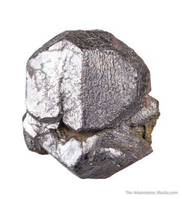
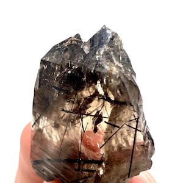
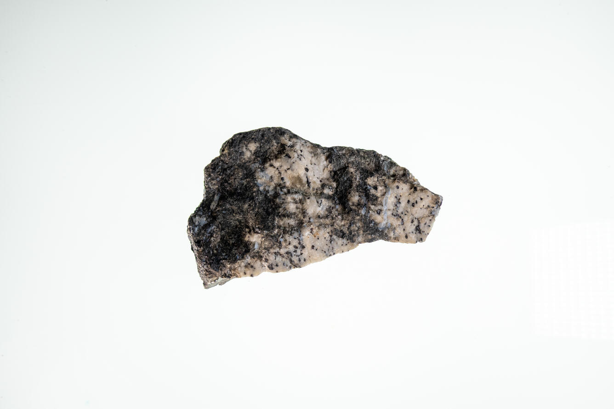
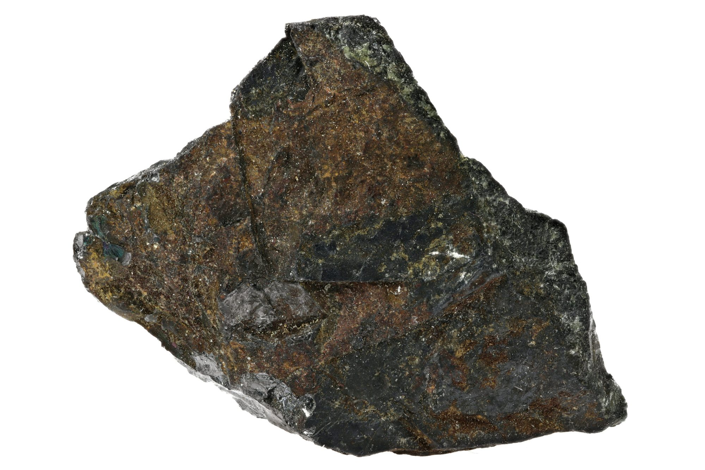

# Titanium Minerals (Ilmenite, Rutile, Leucoxene)

> **Group:** Metallic (oxide) · **Minerals:** Ilmenite FeTiO₃ · Rutile TiO₂ · Leucoxene · **Element:** Titanium (Ti)
> **Quick ID:** Dense black "black sands"; ilmenite has a **black streak**, rutile a **pale yellow-brown streak** and adamantine lustre.

## At a glance

| Property | Ilmenite | Rutile |
|---|---|---|
| Colour | Black | Reddish-brown to black |
| Streak | **Black** | Pale yellow-brown |
| Lustre | Metallic | Adamantine |
| Hardness | 5–6 | 6–6.5 |
| Magnetism | Weakly magnetic | Non-magnetic |
| Key test | Black streak, magnetic | Pale streak, adamantine |

## Chemistry & mineralogy
- **Ilmenite** — iron titanate, FeTiO₃ (the main Ti ore).
- **Rutile** — titanium dioxide, TiO₂ (higher Ti content).
- **Leucoxene** — fine-grained, altered ilmenite (enriched in TiO₂).

Titanium is abundant in the Earth's crust but concentrated economically only in placer sands.

## Crystal habit
**Ilmenite:** massive, platy, or sand-sized grains. **Rutile:** prismatic, acicular, or knee-twinned crystals (also sand grains). In placers, both occur as sand-sized dense grains.

## Physical properties
- **Ilmenite:** hardness 5–6; black, metallic; **black streak**; heavy; weakly magnetic.
- **Rutile:** hardness 6–6.5; reddish-brown to black, adamantine; **pale yellow-brown streak**; heavy.

## How to identify in the field
1. **Setting:** dense black grains in **"black sands"** (beach/river).
2. **Streak:** ilmenite **black**; rutile **pale yellow-brown**.
3. **Magnet:** ilmenite weakly magnetic; magnetite strongly magnetic.
4. **Lustre:** rutile adamantine (diamond-like); ilmenite metallic.
5. **Weight:** all are heavy (concentrate in the pan).

## Lookalikes & how to distinguish

| Looks like | How to tell it apart |
|---|---|
| **Magnetite** | Magnetite is strongly magnetic with a black streak; ilmenite is weakly magnetic. |
| **Chromite** | Chromite has a brown streak; ilmenite is black-streaked. |
| **Zircon** | Zircon is harder (7.5) and lighter; rutile is adamantine with a pale streak. |

## Occurrence

**Pure specimens:**

*Figure III.A.9a — Ilmenite: black iron-titanium oxide. Source: [iRocks](https://www.irocks.com/minerals/species/buy-ilmenite-fine-mineral-specimens-photos).*

*Figure III.A.9b — Rutile in quartz: reddish titanium dioxide. Source: [Etsy](https://www.etsy.com/market/rutile_specimens).*

*Figure III.A.9c — Rutile (titanium ore). Source: [USGS](https://usgs.gov/media/images/rutile-titanium-ore).*

*Figure III.A.9d — Ilmenite (titanium ore) specimen. Source: [Anglo Pacific Minerals](https://angpacmin.com/products/ilmenite/).*

**In rock:** concentrated in **heavy-mineral beach and river sands ("black sands")** (see [Placers & alluvium](../../02-rocks-of-nigeria/sedimentary/placers-alluvium.md)).

## Genesis
**Placer concentration** — dense Ti minerals are sorted and concentrated by waves and rivers from source rocks. Titanium is derived from weathering of igneous/metamorphic rocks and concentrated along coastlines.

## States / localities
Coastal and river heavy-mineral sands: **Lagos, Ondo, Delta, Rivers, Akwa Ibom, Cross River**, and river placers inland.

## Associated minerals & host rocks
Ilmenite, rutile, magnetite, zircon, monazite, leucoxene; hosted by **beach and river sands (black sands)** (see [Zircon & Monazite](zircon-monazite.md)).

## Mining, uses & market
Source of **titanium dioxide pigment** (paints, paper, plastics) and **titanium metal** (strong, light — aerospace, medical implants, welding electrodes). Titanium is a strategic, high-value metal.

## Exploration notes
- **Sample beach/river sands** and pan for dense black grains.
- **Black sands** (ilmenite + magnetite) are the target horizon.
- Separate ilmenite (black streak) from rutile (pale streak) and magnetite (magnetic).

## Field checklist
- [ ] Dense black grains in black sands?
- [ ] Black streak (ilmenite) or pale streak (rutile)?
- [ ] Weakly magnetic (ilmenite) vs strongly (magnetite)?
- [ ] Beach/river placer setting?
- [ ] With zircon, monazite, magnetite?

## Facts
- **Black sands** on Nigerian beaches are rich in **ilmenite** (titanium ore).
- **Rutile** has a distinctive **adamantine** (diamond-like) lustre.
- Titanium dioxide is the bright **white pigment** in paint and paper.
- Titanium metal is **strong, light, and biocompatible** — used in aircraft and implants.

## Related
- [Zircon & Monazite](zircon-monazite.md) · [Placers & alluvium](../../02-rocks-of-nigeria/sedimentary/placers-alluvium.md) · [Laterite & Ferricrete](../../02-rocks-of-nigeria/sedimentary/laterite-ferricrete.md)
