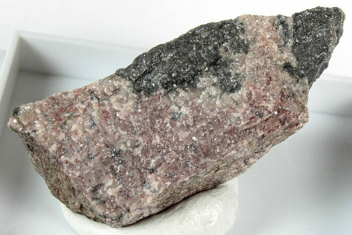
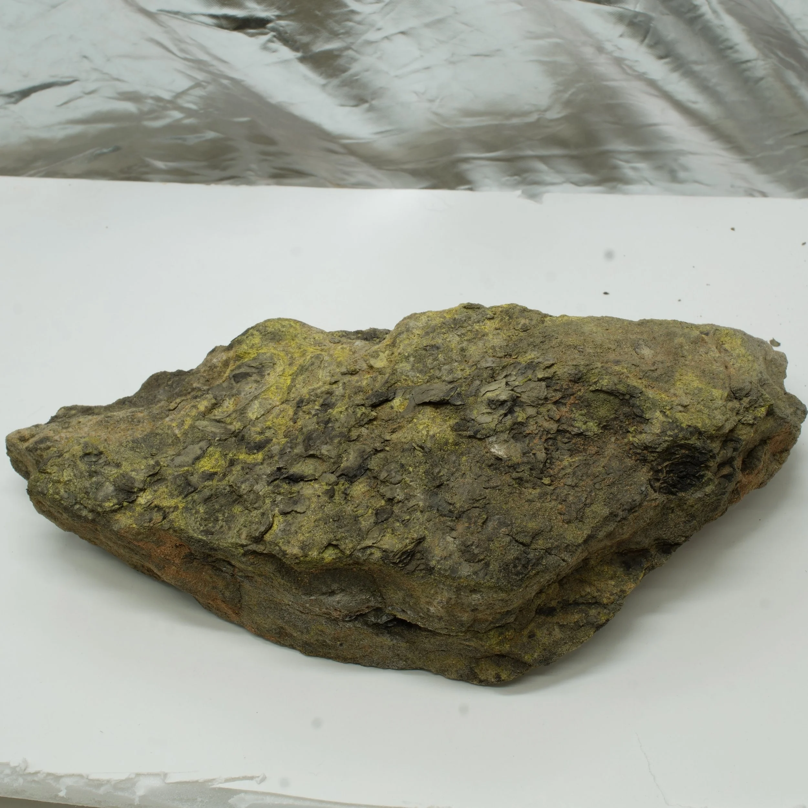

# Uranium Minerals

> **Group:** Metallic (oxide) · **Minerals:** Uraninite / pitchblende (UO₂), secondary U minerals · **Element:** Uranium (U)
> **Quick ID:** Black (pitchblende), hardness 5–6, **pitchy (tar-like) lustre**, very heavy (SG ~8–10), **RADIOACTIVE**; bright yellow-green secondary minerals.

## At a glance

| Property | Value |
|---|---|
| Colour | Black (pitchblende); bright yellow-green secondaries |
| Streak | Black to brownish |
| Lustre | Pitchy (tar-like) to submetallic |
| Hardness | 5–6 |
| Specific gravity | **~8–10** (very heavy) |
| Radioactivity | **RADIOACTIVE** (Geiger counter) |
| Key test | Radioactive + yellow-green secondaries + heavy |

## Chemistry & mineralogy
**Uraninite** (UO₂) and its massive variety **pitchblende**, plus bright secondary minerals (carnotite, torbernite — yellow/green). Uranium decays radioactively, producing lead. It is the primary fuel for nuclear power.

## Crystal habit
**Pitchblende:** massive, botryoidal, pitchy. **Uraninite:** cubic/octahedral crystals. Secondaries form yellow-green crusts. In hand specimen, pitchblende looks like black tar.

## Physical properties
- **Hardness 5–6**; **colour** black (pitchblende) with a **pitchy (tar-like) lustre**.
- **Very heavy** (SG ~8–10).
- **RADIOACTIVE** — confirm with a **Geiger counter/scintillometer** (the definitive field tool). Bright **yellow-green secondary minerals** are a strong clue.

## How to identify in the field
1. **Radioactivity:** a **Geiger counter/scintillometer** is the definitive test.
2. **Weight:** very heavy (SG ~8–10).
3. **Lustre:** pitchy (tar-like), black.
4. **Secondaries:** bright **yellow-green** crusts (carnotite, torbernite).
5. **Setting:** pegmatites (with columbite/monazite) or certain sandstones.

## Lookalikes & how to distinguish

| Looks like | How to tell it apart |
|---|---|
| **Other black heavy oxides** | Uraninite is confirmed by **radioactivity** (Geiger counter) — the decisive test. |
| **Pitchblende vs coal/bitumen** | Pitchblende is very heavy and radioactive; coal/bitumen are light and not. |

## Occurrence

**Pure specimen** (pitchblende):

*Figure III.A.8a — Pitchblende (uraninite): black, radioactive uranium oxide. Source: [Fossilera](https://www.fossilera.com/minerals/1-3-uraninite-pitchblende-specimen-uranium-based--2).*

**In rock / ore** (with yellow secondary minerals):

*Figure III.A.8b — Uranium ore with yellow secondary uranium minerals. Source: [Azuranium](https://azuranium.com/shop/p/high-grade-uranium-ore-colorado-plateau-50000-cpm).*

## Genesis
**Hydrothermal veins**, **pegmatites**, and **sandstone-hosted (roll-front)** deposits. In Nigeria, occurrences are linked to **pegmatites** and certain **sandstones**.

## States / localities
Reported occurrences in **Benue, Plateau, Cross River, Bauchi, Kogi, Sokoto, Adamawa** and parts of the **Younger Granite** pegmatites. Nigeria has explored uranium, though it is not currently a major producer.

## Associated minerals & host rocks
Columbite, monazite, zircon; hosted by **pegmatites and sandstones** (see [Columbite–Tantalite](columbite-tantalite.md), [Zircon & Monazite](zircon-monazite.md)).

## Mining, uses & market
The fuel for **nuclear power** (and, historically, weapons). Strategically important; subject to strict regulation and **radiation-safety** controls.

## Exploration notes
- **Radiometric surveys** (gamma-ray spectrometry) and **Geiger counters** are the primary tools.
- Check **pegmatites** (with columbite/monazite) and certain **sandstones**.
- ⚠️ **Radiation safety:** avoid inhalation/ingestion of dust; follow protocols.

## Field checklist
- [ ] Geiger counter clicks (radioactive)?
- [ ] Very heavy black mineral?
- [ ] Pitchy (tar-like) lustre?
- [ ] Yellow-green secondary minerals?
- [ ] Pegmatite or sandstone setting?

## Facts
- A **Geiger counter** is the definitive field tool for uranium (radioactivity).
- Bright **yellow-green** secondary minerals (carnotite, torbernite) signal uranium.
- Uranium is the fuel for **nuclear power** — a strategic, regulated mineral.
- ⚠️ **Radiation safety** is essential: avoid dust inhalation/ingestion.

## Related
- [Columbite–Tantalite](columbite-tantalite.md) · [Zircon & Monazite](zircon-monazite.md) · [The sedimentary basins](../../01-general-geology/01-04-sedimentary-basins.md) · [Field safety](../../05-field-identification/05-08-field-safety.md)
