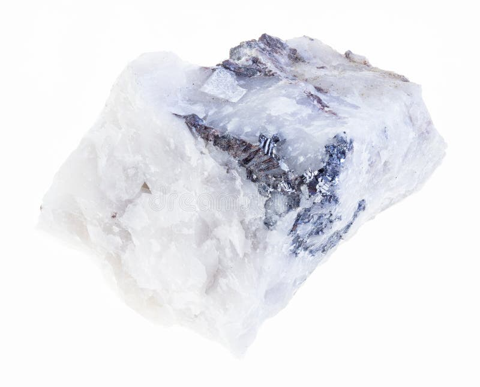
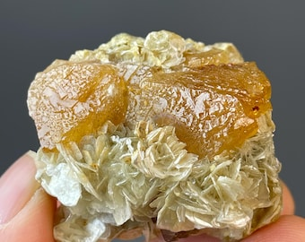

# Wolframite & Scheelite (Tungsten Ore)

> **Group:** Metallic · **Formulas:** Wolframite (Fe,Mn)WO₄ · Scheelite CaWO₄ · **Element:** Tungsten (W)
> **Quick ID:** Wolframite = black/brown, very heavy (SG ~7–7.5), one perfect cleavage; **scheelite fluoresces bright blue-white under UV light**.

## At a glance

| Property | Wolframite | Scheelite |
|---|---|---|
| Colour | Black to brown | White, yellow, green, orange |
| Streak | Brown-black | White |
| Lustre | Submetallic | Resinous/greasy |
| Hardness | 5–5.5 | 4.5–5 |
| Specific gravity | **~7–7.5** (very heavy) | ~6 |
| Cleavage | One perfect | Distinct |
| Key test | Heavy + one perfect cleavage | **Fluoresces under UV** |

## Chemistry & mineralogy
- **Wolframite** — iron–manganese tungstate (ferberite is Fe-rich, hübnerite Mn-rich).
- **Scheelite** — calcium tungstate.
Both are **ores of tungsten**. Chemically a tungstate (WO₄) combined with iron/manganese or calcium.

## Crystal habit
- **Wolframite:** tabular/bladed crystals or massive.
- **Scheelite:** tetragonal dipyramidal (wedge-shaped) crystals, often in skarns.

## Physical properties
- **Wolframite:** hardness 5–5.5; submetallic; black to brown; **very heavy** (SG ~7–7.5); one perfect cleavage.
- **Scheelite:** hardness 4.5–5; resinous; white/yellow/green/orange; **fluoresces bright blue-white under ultraviolet (UV) light** — a definitive field test!

## How to identify in the field
1. **Wolframite:** very heavy (SG ~7–7.5), black/brown, one perfect cleavage — heavy mineral in a pan.
2. **Scheelite:** pale, wedge-shaped, and **fluoresces blue-white under a UV lamp** — instant confirmation.
3. **Streak:** wolframite brown-black; scheelite white.
4. **Association:** with cassiterite (tin) in the same ground.
5. **Setting:** veins/greisen (wolframite) or skarn (scheelite).

## Lookalikes & how to distinguish

| Looks like | How to tell it apart |
|---|---|
| **Cassiterite** | Cassiterite has a white-grey streak and no cleavage; wolframite has a brown-black streak and one perfect cleavage. |
| **Quartz / calcite (vs scheelite)** | Scheelite fluoresces under UV; quartz/calcite generally do not. |
| **Magnetite** | Magnetite is magnetic; wolframite is not. |

## Occurrence

**Pure specimens:**

*Figure III.A.6a — Wolframite (ferberite): black/bladed tungsten mineral. Source: [Etsy](https://www.etsy.com/market/wolframite_specimen).*

*Figure III.A.6b — Scheelite: pale, wedge-shaped tungstate (fluoresces under UV). Source: [Etsy](https://www.etsy.com/listing/4307179785/1780g-178kg-scheelite-tungsten-ore).*

*Figure III.A.6c — Wolframite (tungsten ore) crystal. Source: [Reddit r/Minerals](https://www.reddit.com/r/Minerals/comments/13fo75v/tungsten_ore_from_china_wolframite_crystal/).*

*Figure III.A.6d — Scheelite (tungsten ore) on mica. Source: [Etsy](https://www.etsy.com/listing/4307179785/1780g-178kg-scheelite-tungsten-ore).*

**In rock:** hydrothermal **veins and greisens** in and around the tin granites and pegmatites (see [Pegmatite](../../02-rocks-of-nigeria/igneous/pegmatite.md)); scheelite in **skarns** at granite–limestone contacts (see [Skarn](../../02-rocks-of-nigeria/metamorphic/skarn.md)).

## Genesis
**Hydrothermal**, closely associated with **tin** mineralization in the Younger Granites — wolframite in quartz veins/greisen; scheelite in skarns at granite–limestone contacts. Tungsten travels with the same hot fluids that carry tin.

## States / localities
**Jos Plateau** (**Plateau**), plus **Bauchi, Kaduna, Nasarawa** — wherever the tin-bearing granites occur. Nigerian tungsten is a by-product/co-product of the tin ground.

## Associated minerals & host rocks
Cassiterite, quartz, mica, molybdenite, scheelite; hosted by **pegmatites, greisens, and skarns** (see [Cassiterite](cassiterite.md)).

## Mining, uses & market
Smelted to **tungsten metal** — valued for its extreme melting point and hardness, used in **carbide cutting tools, light-bulb filaments, and superalloys**. A strategic, high-value metal (tungsten has the highest melting point of all metals).

## Exploration notes
- Tungsten accompanies **cassiterite** — map the same tin ground (see [Cassiterite](cassiterite.md)).
- Carry a **UV lamp**: **scheelite fluoresces** — an instant indicator.
- **Heavy-mineral/panning** picks up the very dense wolframite.

## Field checklist
- [ ] Very heavy black/brown grains (wolframite)?
- [ ] One perfect cleavage (wolframite)?
- [ ] Pale wedge crystals fluorescing under UV (scheelite)?
- [ ] With cassiterite / in tin ground?
- [ ] Vein/greisen (wolframite) or skarn (scheelite)?

## Facts
- **Tungsten** has the **highest melting point** of all metals (3422 °C).
- **Scheelite fluoresces** bright blue-white under UV — a definitive, memorable field test.
- Wolframite is **very dense** (SG ~7–7.5) — it concentrates in panners' heavy mineral.
- Nigerian tungsten is tied to the **Jos Plateau tin** ground.

## Related
- [Cassiterite](cassiterite.md) · [Pegmatite](../../02-rocks-of-nigeria/igneous/pegmatite.md) · [Skarn](../../02-rocks-of-nigeria/metamorphic/skarn.md) · [The Younger Granites](../../01-general-geology/01-03-younger-granite-ring-complexes.md)
