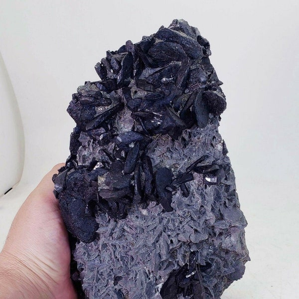

# Wolframite & Scheelite (Tungsten Ore)

> **Group:** Metallic · **Formulas:** Wolframite (Fe,Mn)WO₄ · Scheelite CaWO₄ · **Element:** Tungsten (W)

## Chemistry & mineralogy
- **Wolframite** — iron–manganese tungstate (ferberite is Fe-rich, hübnerite Mn-rich).
- **Scheelite** — calcium tungstate.
Both are **ores of tungsten**.

## Crystal habit
- **Wolframite:** tabular/bladed crystals or massive.
- **Scheelite:** tetragonal dipyramidal (wedge-shaped) crystals, often in skarns.

## Physical properties & how to test
- **Wolframite:** hardness 5–5.5; submetallic; black to brown; **very heavy**
  (SG ~7–7.5); one perfect cleavage.
- **Scheelite:** hardness 4.5–5; resinous; white/yellow/green/orange; **fluoresces
  bright blue-white under ultraviolet (UV) light** — a definitive field test!

## Occurrence

**Pure specimens:**

*Figure III.A.6a — Wolframite (ferberite): black/bladed tungsten mineral. Source: [Etsy](https://www.etsy.com/market/wolframite_specimen).*

*Figure III.A.6b — Scheelite: pale, wedge-shaped tungstate (fluoresces under UV). Source: [Etsy](https://www.etsy.com/listing/4307179785/1780g-178kg-scheelite-tungsten-ore).*

**In rock:** hydrothermal **veins and greisens** in and around the tin granites and
pegmatites (see [Pegmatite](../../02-rocks-of-nigeria/igneous/pegmatite.md)).

## Genesis
**Hydrothermal**, closely associated with **tin** mineralization in the Younger
Granites — wolframite in quartz veins/greisen; scheelite in skarns at granite–
limestone contacts.

## States / localities
**Jos Plateau** (**Plateau**), plus **Bauchi, Kaduna, Nasarawa** — wherever the
tin-bearing granites occur.

## Mining, uses & market
Smelted to **tungsten metal** — valued for its extreme melting point and hardness,
used in **carbide cutting tools, light-bulb filaments, and superalloys**. A
strategic, high-value metal.

## Exploration notes
- Tungsten accompanies **cassiterite** — map the same tin ground
  (see [Cassiterite](cassiterite.md)).
- Carry a **UV lamp**: **scheelite fluoresces** — an instant indicator.
- **Heavy-mineral/panning** picks up the very dense wolframite.

## Related
- [Cassiterite](cassiterite.md) · [Pegmatite](../../02-rocks-of-nigeria/igneous/pegmatite.md) · [The Younger Granites](../../01-general-geology/01-03-younger-granite-ring-complexes.md)
