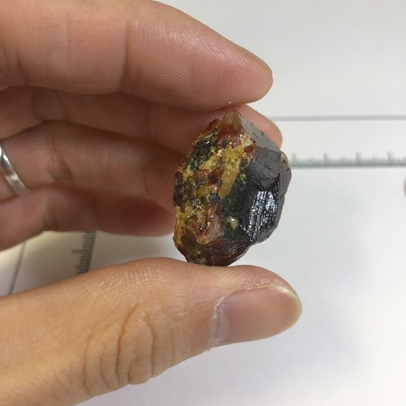
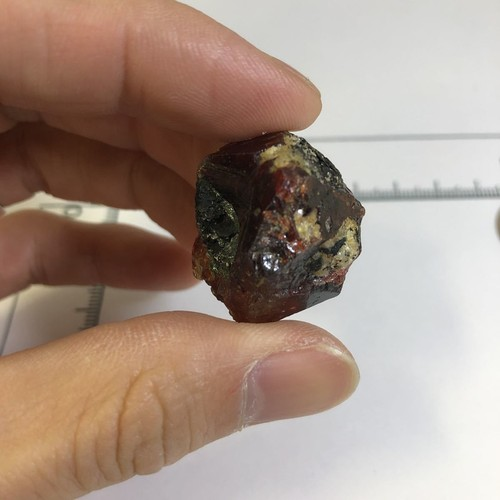

# Zircon & Monazite (Heavy Minerals / REE)

> **Group:** Metallic (silicate / phosphate) · **Minerals:** Zircon ZrSiO₄ · Monazite (Ce,La,Th)PO₄ · **Elements:** Zr, REE, Th
> **Quick ID:** Dense in sands; **zircon** is hard (7.5), adamantine, colourless–brown; **monazite** is resinous, yellow-brown, and mildly **radioactive**.

## At a glance

| Property | Zircon | Monazite |
|---|---|---|
| Colour | Colourless to brown/red | Yellow-brown to reddish |
| Streak | White | White to grey |
| Lustre | Adamantine | Resinous |
| Hardness | **7.5** (scratches quartz) | 5–5.5 |
| Specific gravity | ~4.6 (heavy) | ~5 (heavy) |
| Radioactivity | Usually none | **Mildly radioactive** (thorium) |
| Key test | Hardness 7.5 + adamantine | Resinous + radioactive |

## Chemistry & mineralogy
- **Zircon** — zirconium silicate, ZrSiO₄ (often with hafnium, rare earths).
- **Monazite** — a rare-earth **phosphate**, (Ce,La,Nd,Th)PO₄ — a key **REE ore** (contains thorium, so it is mildly radioactive).

Both are dense "heavy minerals" that concentrate in sands.

## Crystal habit
**Zircon:** tetragonal prisms with pyramidal ends (classic "zircon" shape). **Monazite:** small wedge-shaped or granular crystals. In placers, both appear as small dense grains.

## Physical properties
- **Zircon:** hardness **7.5** (scratches quartz); adamantine; colourless to brown/red; heavy (SG ~4.6).
- **Monazite:** hardness 5–5.5; resinous; yellow-brown to reddish; heavy; **mildly radioactive** (thorium).

## How to identify in the field
1. **Zircon:** very hard (7.5 — scratches quartz), adamantine lustre, small prismatic grains.
2. **Monazite:** resinous, yellow-brown, and **mildly radioactive** (Geiger counter).
3. **Setting:** dense grains in beach/river sands.
4. **Weight:** both heavy (concentrate in the pan).
5. **Association:** with ilmenite, rutile, magnetite in black sands.

## Lookalikes & how to distinguish

| Looks like | How to tell it apart |
|---|---|
| **Rutile** | Rutile is adamantine but softer (6–6.5) with a pale streak; zircon is harder (7.5). |
| **Monazite vs zircon** | Monazite is resinous and radioactive; zircon is adamantine and harder (7.5). |
| **Tourmaline** | Tourmaline is striated and in different settings; zircon is in sands and harder. |

## Occurrence

**Pure specimens:**

*Figure III.A.10a — Zircon crystal. Source: [eBay](https://www.ebay.com/itm/205307778447).*

*Figure III.A.10b — Monazite: rare-earth phosphate. Source: [iRocks](https://www.irocks.com/minerals/specimen/44168).*

*Figure III.A.10c — Zircon crystal specimen. Source: [eBay](https://www.ebay.com/itm/205307778447).*

*Figure III.A.10d — Zircon crystals (Astor Valley, Pakistan). Source: [eBay](https://www.ebay.com/itm/205307778447).*

**In rock:** concentrated in **heavy-mineral beach and river sands**, alongside ilmenite, rutile, and magnetite (see [Placers & alluvium](../../02-rocks-of-nigeria/sedimentary/placers-alluvium.md)). Zircon also occurs in **pegmatites** (see [Pegmatite](../../02-rocks-of-nigeria/igneous/pegmatite.md)).

## Genesis
**Placer concentration** in sands; zircon also crystallizes in **granites/pegmatites**. Both are durable, dense minerals that survive weathering and are sorted into coastal and river sands.

## States / localities
Coastal heavy-mineral sands (**Lagos, Ondo, Delta, Rivers, Akwa Ibom, Cross River**) and pegmatite fields (**Plateau, Nasarawa, Kaduna, Oyo**).

## Associated minerals & host rocks
Ilmenite, rutile, magnetite, columbite–tantalite; hosted by **beach/river sands** and **pegmatites** (see [Titanium minerals](titanium-minerals.md)).

## Mining, uses & market
- **Zircon** — ceramics, refractories, foundry sands, zirconium chemicals, and gems.
- **Monazite** — source of **rare-earth elements** (cerium, lanthanum, neodymium) and **thorium** — increasingly strategic (magnets, electronics, catalysts).

## Exploration notes
- **Heavy-mineral sampling** of beach/river sands (zircon and monazite are dense).
- Monazite often accompanies **ilmenite/rutile** in black sands.
- Zircon's **high hardness (7.5)** helps separate it in the field.

## Field checklist
- [ ] Dense grains in beach/river sands?
- [ ] Zircon: hard (7.5), adamantine?
- [ ] Monazite: resinous, radioactive?
- [ ] With ilmenite/rutile/magnetite (black sands)?
- [ ] Coastal sands or pegmatite setting?

## Facts
- **Zircon's hardness (7.5)** lets it scratch quartz — easy to confirm in the field.
- **Monazite** is a key **rare-earth** ore and is mildly **radioactive** (thorium).
- Both are recovered from Nigerian **beach "black sands."**
- Zircon is also a **gemstone** and used in ceramics/refractories.

## Related
- [Titanium minerals](titanium-minerals.md) · [Placers & alluvium](../../02-rocks-of-nigeria/sedimentary/placers-alluvium.md) · [Uranium minerals](uranium.md) · [Columbite–Tantalite](columbite-tantalite.md)
