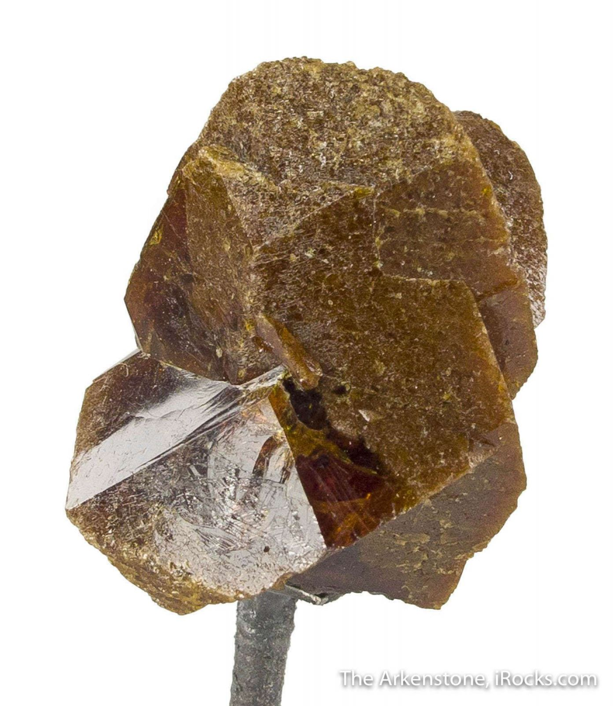

# Zircon & Monazite (Heavy Minerals / REE)

> **Group:** Metallic (silicate / phosphate) · **Minerals:** Zircon ZrSiO₄ · Monazite (Ce,La,Th)PO₄ · **Elements:** Zr, REE, Th

## Chemistry & mineralogy
- **Zircon** — zirconium silicate, ZrSiO₄ (often with hafnium, rare earths).
- **Monazite** — a rare-earth **phosphate**, (Ce,La,Nd,Th)PO₄ — a key **REE ore**
  (contains thorium, so it is mildly radioactive).

## Crystal habit
**Zircon:** tetragonal prisms with pyramidal ends (classic "zircon" shape).
**Monazite:** small wedge-shaped or granular crystals.

## Physical properties & how to test
- **Zircon:** hardness **7.5** (scratches quartz); adamantine; colorless to brown/red;
  heavy (SG ~4.6).
- **Monazite:** hardness 5–5.5; resinous; yellow-brown to reddish; heavy; **mildly
  radioactive** (thorium).

## Occurrence

**Pure specimens:**

*Figure III.A.10a — Zircon crystal. Source: [eBay](https://www.ebay.com/itm/205307778447).*

*Figure III.A.10b — Monazite: rare-earth phosphate. Source: [iRocks](https://www.irocks.com/minerals/specimen/44168).*

**In rock:** concentrated in **heavy-mineral beach and river sands**, alongside
ilmenite, rutile, and magnetite (see [Placers & alluvium](../../02-rocks-of-nigeria/sedimentary/placers-alluvium.md)). Zircon also occurs in **pegmatites**.

## Genesis
**Placer concentration** in sands; zircon also crystallizes in **granites/pegmatites**.

## States / localities
Coastal heavy-mineral sands (**Lagos, Ondo, Delta, Rivers, Akwa Ibom, Cross River**)
and pegmatite fields (**Plateau, Nasarawa, Kaduna, Oyo**).

## Mining, uses & market
- **Zircon** — ceramics, refractories, foundry sands, zirconium chemicals, and gems.
- **Monazite** — source of **rare-earth elements** (cerium, lanthanum, neodymium) and
  **thorium** — increasingly strategic (magnets, electronics, catalysts).

## Exploration notes
- **Heavy-mineral sampling** of beach/river sands (zircon and monazite are dense).
- Monazite often accompanies **ilmenite/rutile** in black sands.
- Zircon's **high hardness (7.5)** helps separate it in the field.

## Related
- [Titanium minerals](titanium-minerals.md) · [Placers & alluvium](../../02-rocks-of-nigeria/sedimentary/placers-alluvium.md) · [Uranium minerals](uranium.md)
