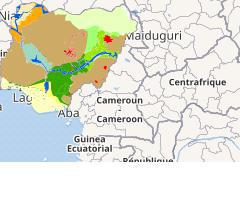

# Part IV — Geological Provinces, Belts & Key Districts

Where Nigeria's rocks and minerals actually **are** — organized by geological province,
with the **states** involved and links to the detailed rock/mineral profiles.

*Map of Nigeria's geology. Source: [IGRAC — Africa Groundwater Atlas (2019)](https://ggis.un-igrac.org/).*

| § | Province / Belt | Headline resources |
|---|-----------------|--------------------|
| 4.1 | [Jos Plateau / Younger Granite tin province](04-01-jos-plateau-tin-province.md) | Tin, columbite, tungsten, gems |
| 4.2 | [SW Nigeria schist belts](04-02-schist-belts-gold.md) | Gold, columbite |
| 4.3 | [Benue Trough](04-03-benue-trough.md) | Coal, lead-zinc, salt, limestone, iron, barite |
| 4.4 | [Chad (Borno) Basin](04-04-chad-basin.md) | Gypsum, salt, limestone, uranium |
| 4.5 | [Niger Delta Basin](04-05-niger-delta-basin.md) | Petroleum & natural gas |
| 4.6 | [Dahomey & Sokoto Basins](04-06-dahomey-sokoto-basins.md) | Bitumen, phosphate, limestone |
| 4.7 | [Coastal & river placer belts](04-07-placer-belts.md) | Heavy minerals, placer tin & gold |
| 4.8 | [Basement Complex terranes](04-08-basement-terranes.md) | Gold, pegmatite minerals, industrial |
| 4.9 | [**State-by-state reference table**](04-09-state-by-state-table.md) | Every state's key rocks & minerals |
